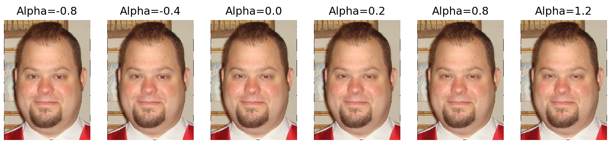
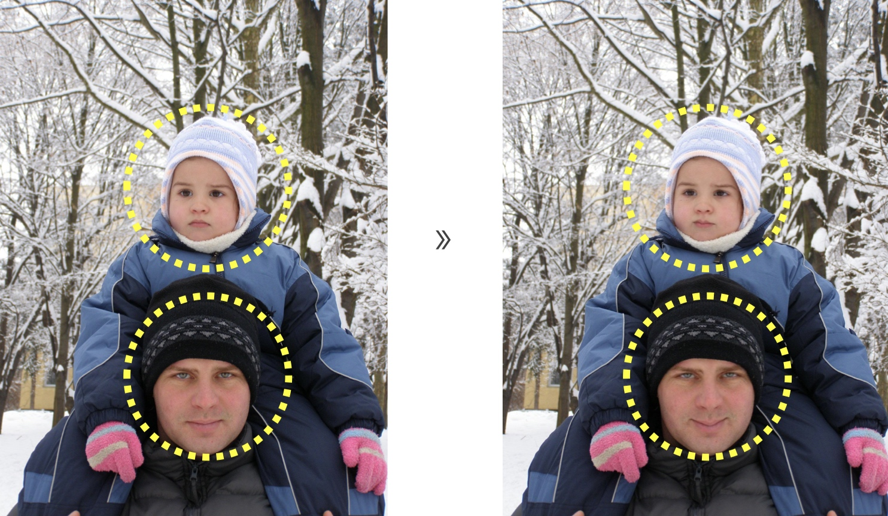

# 开始
创建虚拟环境，安装需要的包，运行几个例子。
```
cd JustSmile
./get_started.sh
```
当安装虚拟环境时，需要确认安装。如果`./get_started.sh` 不能正常运行，则使用 `sudo bash ./get_started.sh`。如果你的python环境是3.7，你也可以直接安装需要的包。

```
pip install -r requirements.txt #-i https://pypi.tuna.tsinghua.edu.cn/simple
```

你可以通过`-i`选项来更改pip的镜像以提高安装速度。代码没有在其他python版本上测试过，但是应该可以在python 3.6+上正常运行。

# 如何处理你的图片

图像大小最好不要超过1M，否则你可能不能正常使用Azure提供的face API。以下是两个处理图像的例子。

```
cd code
python args_just_smile_manual.py --type 1 --input_image_path "../test_images/p4/training_07267.jpeg" --mouth_alpha 0.8
python args_just_smile_auto_v1.py --type 2 --input_image_path "../test_images/p3/training_04158.jpeg" --mouth_alpha 0.75 --eye_alpha 0.9
```

## 关于参数
|选项           | 说明|
| -----------------|----------------------------- |
|--input_image_path| 待处理图像的路径|
|--type             |当 type=1时, 仅改变嘴唇. 当 type=2时, 同时改变嘴唇和眼睛.|
|--mouth_alpha     |正小数. mouth_alpha越大, 微笑看起来越明显. 推荐的最大值为 $1.25$.|
|--eye_alpha       |正小数. eye_alpha越大, 眼睛会越像月牙形. 推荐的最大值为 $1.20$.|

**Mouth vs Alpha**


**Eyes vs Alpha**


## 关于手动模式&自动模式
`args_just_smile_manual.py` 是手动模式。在弹出的窗口中，你可以用鼠标左键手动框选需要改变的人脸，然后按两次回车键即可。

`args_just_smile_auto_v1.py` 是自动模式。此模式会调用Microsoft的Azure Face API来自动判断中性表情的人脸，然后对每张中性表情的人脸进行变换。

所有的输出都在`outputs`文件夹里。其子文件夹的名字由*出入图片的名称*、*type parameter*的取值和*时间戳*组成。在这个子文件夹下，`log.txt` 记录了处理图像的信息， `input.xxx`为处理前的图片，`output.xxx` 为处理后得到的图片。

## 关于数据集

所有的测试图像都来自于[Social Relation Dataset](http://mmlab.ie.cuhk.edu.hk/projects/socialrelation/index.html).

## 示例

左侧的均为输入图片，右侧的均为输出的图片。黄色虚线框只用于说明，输出的图片上不会有。你可以通过这个[demo](https://youtu.be/iHTBCI0DAXc)看一下图像处理的全过程。

### 手动模式: 一个人


### 自动模式: 没有改变


### 自动模式: 一个人


### 自动模式: 多于一个人



# Q&A

**Q: Azure API 不能正常使用。报错说key有问题。**

**A:** 单击这个[链接](https://azure.microsoft.com/en-us/try/cognitive-services/my-apis/?api=face-api)。
1. 注册一个账号.。
2. 打开 `FaceSDKCopy.py`，修改 `KEY` 和 `BASE_URL`。
3. 不要关闭你登录的页面（就是上面这个链接）。
4. 运行程序。
  
# 作者
- Octemull
- Jiang
- Zhou
- Xiang
