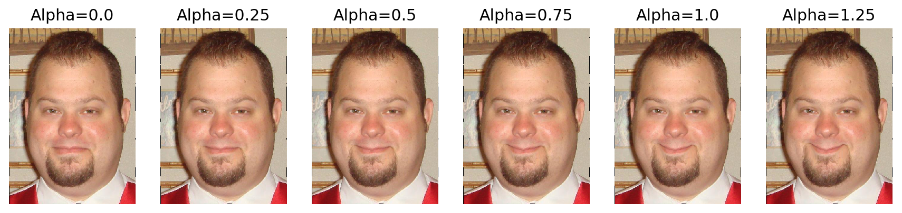
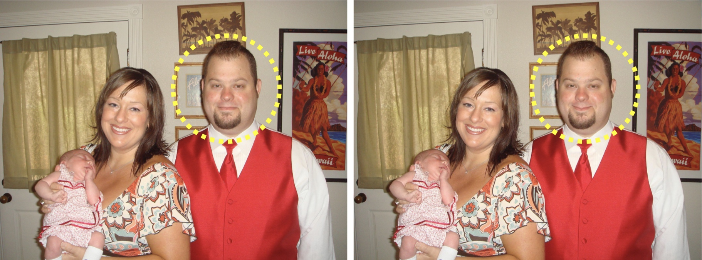

# Get Start
Create enviroment, install packages, run examples
```
cd JustSmile
./get_started.sh
```
When configuring the environment, you need to **confirm** the installation. If `./get_started.sh` doesn't work, try `sudo bash ./get_started.sh` instead. If you want and your environment is `python3.7`, you can also just install the required packages.

```
pip install -r requirements.txt #-i https://pypi.tuna.tsinghua.edu.cn/simple
```
You can change the mirror of pip with `-i` . 
The code was not tested in other python versions, and it should work in python 3.6+.

# How to process your image

Image size should not exceed 1M, or you can't use the face API provided by Azure. Two examples are listed below.

```
cd code
python args_just_smile_manual.py --type 1 --input_image_path "../test_images/p4/training_07267.jpeg" --mouth_alpha 0.8
python args_just_smile_auto_v1.py --type 2 --input_image_path "../test_images/p3/training_04158.jpeg" --mouth_alpha 0.75 --eye_alpha 0.9
```
## About the parameters
|Options           | Description|
| -----------------|----------------------------- |
|--input_image_path| The path of your input image|
|--type             |When type=1, only change mouth. When type=2, change both mouth and eyes.|
|--mouth_alpha     |Positive float number. The bigger the mouth_alpha is, the more obvious the smile is. Recommend maximum is $1.25$.|
|--eye_alpha       |Positive float number. The bigger the eye_alpha is, the eyes will be more like cresent shape. Recommend maximum is $1.20$.|

**Mouth vs Alpha**


**Eyes vs Alpha**


## About the manual and auto mode
`args_just_smile_manual.py` allow you to choose the face you want and make it smile. In the pop-up image window, press and drag the left mouse button to select a face. Then press the Enter button twice to confirm your choice.

`args_just_smile_auto_v1.py` is an automatic approach which use Azure Face API to get the neutral faces and do facial expression transformation.

All outputs will be in a subfolder of the `outputs` folder. The name of the subfolder consists of the *input image name*, the value of the *type parameter*, and the *timestamp*. In the subfolder, `log.txt` file holds the information of the processed image, `input.xxx` is the unprocessed image, and `output.xxx` is the processed image.

## About the dataset
All test images are obtained from [Social Relation Dataset](http://mmlab.ie.cuhk.edu.hk/projects/socialrelation/index.html).

## Examples

Input images are on the left, output images are on the right. And there won't be any yellow circle in the output images. You can take a look at this [demo](https://youtu.be/iHTBCI0DAXc) to see how it works.

### Manual: one person


### Auto: no change


### Auto: one person


### Auto: more than one person


# Q&A
**Q: Azure API doesn't work. Something wrong with the key.**

**A:** If the Azure Face API won't work for auto approach, click the link below.
https://azure.microsoft.com/en-us/try/cognitive-services/my-apis/?api=face-api
1. Create an account. 
2. Open `FaceSDKCopy.py`, change the `KEY` and `BASE_URL`.
3. Don't close the website (the above one) which you login.
4. Run the program.
  
# Authors
- Octemull
- Jiang
- Zhou
- Xiang
